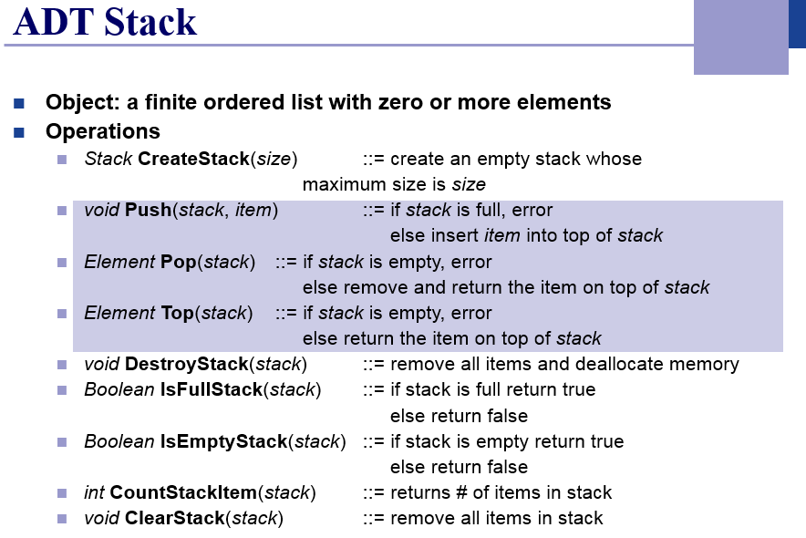

## HW1. Stack 
1. Implement the following ADT stack using array and linked list; you should implement both of them. You should utilize them at the next problems. (다음의 ADT를 만족하는 stack을 array와 linked list 두 가지 버전으로 구현하시오. 이 구현한 부분을 이후 문제에서는 활용할 것.)

2. Reversing data. Print out the input data as its reversing order. (모든 자료를 Push하고 모두 Pop하기)

3. Convert decimal to binary. If you get a positive integer as input, you should print out its binary number. (2로 나눈 나머지를 Push하고 몫이 0이 되면모두 Pop하기)

4. Implement a calculator which can add, subtract, multiply and divide (+, -, \*, /). But, your program should meet the following requirements. (괄호를 포함하는 4칙 연산(+, -, \*, /)이 가능한 Calculator. 다음을 포함해야 함.)

-	Your program should analyze an expression given by token. The expressions will contain space, ‘(‘, and ‘)’ as well as double or three figures. Maybe, there is no space at the expression fiven. You can utilize the token analyzer functions in C language. (수식을 통으로 받아서 token으로 분석 (빈칸으로 구분이 안되는 붙은 식도 분석 가능해야 함. C에서 제공하는 token 분석하는 함수도 있음.) 빈칸도 있을 수 있고, 괄호도 있을 수 있고, 두 자리 이상의 수도 처리가능해야 함.)

-	Your program should change infix notation (the expression given) to postfix notation. (Infix notation -> postfix 로 변환)

-	Your program should check the validity of the expression given. For example, the pair of ( ), whether the expression can be calculated or not (수식의 유효성 검사. 예를 들면, 괄호를 열기만 하고 닫지 않았다던지 하는부분 및 이항연산식을 표현한 건지 등.)

-	이항연산자에 대해서만 다루어도 된다.
-	소수점까지 고려해본다.
